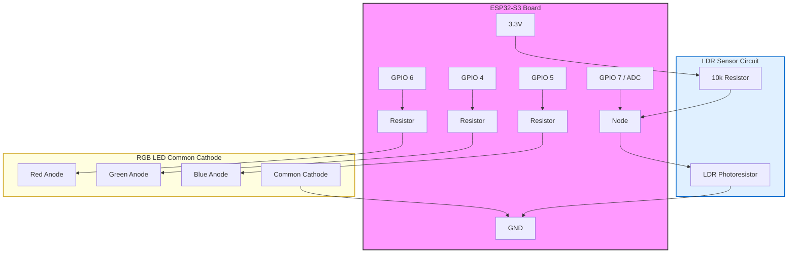
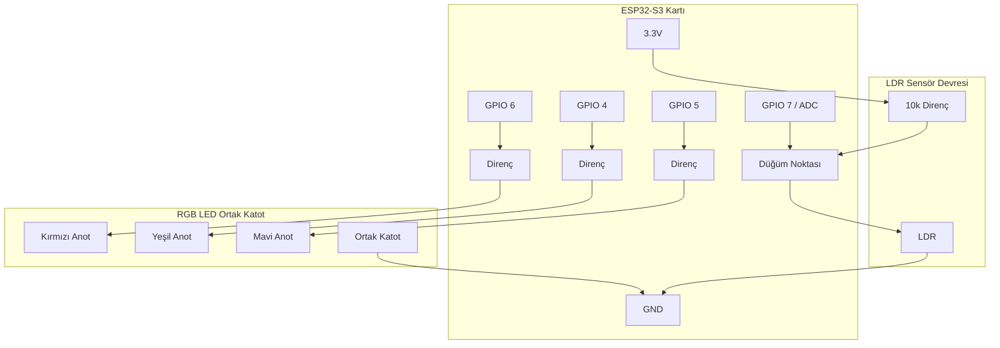
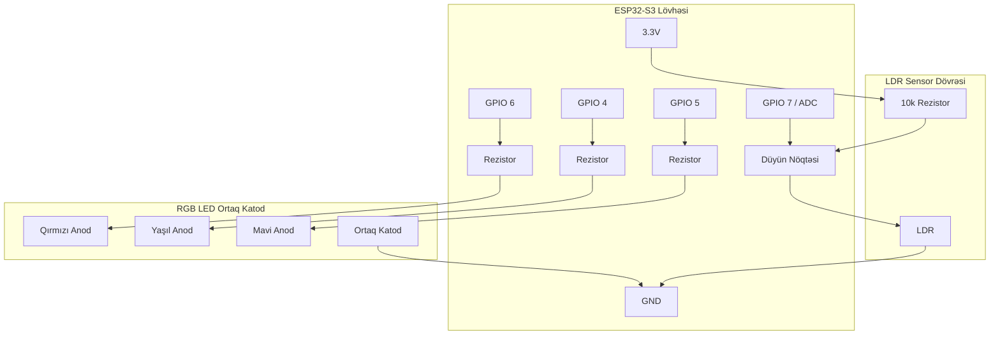

# 🌈 ESP32-S3 Advanced Color Prediction System (TensorFlow Lite)

[**English**](#english) | [**Türkçe**](#türkçe) | [**Azərbaycan**](#azərbaycan)

---

## 🇬🇧 English: High-Precision 30-Color Recognition with TinyML

### 📌 Overview
This project is a state-of-the-art **TinyML color recognition system** built on the **ESP32-S3**. It achieves **100% accuracy** (on 29/30 colors) using a massive training dataset of **120,000 samples**. Unlike simple RGB sensors, this system uses a custom **LDR (Light Dependent Resistor)** and **RGB LED** setup to extract **29 advanced optical features**.

### 📈 Model Training Performance
The model was trained for over 100 epochs. As seen in the graph below, the **Accuracy (Orange)** rapidly climbed to nearly 100%, while **Loss (Blue)** dropped to near zero, indicating a highly stable and well-fitted model without significant overfitting.

### 🛠 Hardware Setup & 3D Print
The physical design is critical for accuracy.
*   **Structure**: A custom 3D-printed **circular pipe**.
*   **Sensor Placement**: The **LDR** is placed in the exact center, **recessed (positioned lower)** to avoid direct interference from the LEDs.
*   **LED Layout**: Red, Green, and Blue LEDs are mounted around the rim at equal distances.
*   **Material**: The enclosure **MUST be 3D printed in BLACK**.
    *   *Why?* Tests showed that light-colored prints (e.g., Light Blue) cause light reflection/leakage that degrades accuracy. Black absorbs stray light.

### 🔌 Circuit Schematic
Since the physical setup is custom, here is the wiring diagram for the **ESP32-S3** with **RGB LED** and **LDR**:

*Note: The **LDR** acts as a pull-down in this schematic (or pull-up depending on wiring), forming a voltage divider with the 10k resistor. The RGB LED is Common Cathode.*

### ⚙️ ESP32-S3 Settings (Arduino IDE V2)
To build and upload successfully, use the following settings in Arduino IDE:

| Setting | Value | Description |
| :--- | :--- | :--- |
| **Board** | **ESP32S3 Dev Module** | Select strict ESP32-S3 board |
| **USB CDC On Boot** | **Enabled** | Required for Serial Monitor |
| **PSRAM** | **OPI PSRAM** | **CRITICAL**: Code requires external RAM for Tensor Arena |
| **Partition Scheme** | **Default 4MB with Spiffs** | Or any scheme with ample app space + file system |
| **Upload Mode** | **UART0 / USB OTG** | Depends on your cable connection |

### 📂 How to Upload Filesystem (LittleFS)
This project requires `model.tflite` to be stored in the ESP32's flash memory via LittleFS.
1.  **Install Plugin**: For Arduino IDE 2.x, download and install the **ESP32 LittleFS Uploader** (search for `arduino-esp32fs-plugin` specifically for V2 or use the command line tool).
2.  **Prepare Data**: Ensure the `data` folder (containing `model.tflite`) is in the sketch directory.
3.  **Upload**:
    *   Put ESP32-S3 into Bootloader Mode (Hold BOOT, Press RST, Release BOOT).
    *   Select **Tools > ESP32 Sketch Data Upload** (or `Upload LittleFS`).
    *   Wait for "LittleFS Image Uploaded" message.

### ⚠️ Known Issues
*   **Lime vs. Green**: The system has **100% accuracy** for 29 colors. However, **Lime** is occasionally misclassified as **Green**.
    *   *Reason*: In the dataset (and physically), the RGB spectral response for Lime and specific Green shades are nearly identical (same tone/RGB codes), making them statistically indistinguishable even with 120K samples.

### 📊 Advanced Data Analysis & Visualization
We have included detailed graphs to demonstrate the robustness of the model. All 13+ analysis graphs are located in the `images/` folder.
*   **Confusion Matrix**: (`images/notebook_confusion_matrix_4.png`)
    This matrix confirms that almost all 30 colors are predicted with high confidence. The diagonal line represents correct predictions.
*   **Training Accuracy**: (`images/training_accuracy_graph_3.png`)
    Shows the convergence of the model during the training phase.
*   **Dataset Distribution**: (`images/extracted_graph_0.png` etc.)
    These graphs visualize the RGB sensor readings for different color classes, showing clear separation which allows for high accuracy.

### 💻 Real-Time Visualization Tool (Processing)
Located in `visualition/visualition.pde`.
*   **Purpose**: Visualizes the color predicted by the ESP32 on your computer screen in real-time.
*   **How to Run**:
    1.  Download **Processing IDE** (processing.org).
    2.  Open `visualition.pde`.
    3.  Connect ESP32 via USB.
    4.  Run the sketch (Play button).
*   **Function**: Reads the serial data (e.g., "Red (99.9%)") and changes the window background to that color.
*   **Language**: The code is written in Java (Processing) and includes Azerbaijani comments for explanation.

### 📂 Data Collection Tools
The `make_dataset` folder contains the tools used to create the 120,000-sample dataset:
*   **make_dataset.py**: Python script to capture serial data and save it to CSV.
*   **color_predic.ino**: Arduino sketch for high-speed raw data collection.

---

## 🇹🇷 Türkçe: ESP32-S3 ile Yüksek Hassasiyetli Renk Tanıma

### 📌 Genel Bakış
Bu proje, **ESP32-S3** üzerinde çalışan ve **120.000 verilik devasa bir veri seti** ile eğitilmiş profesyonel bir renk tanıma sistemidir. 30 rengin 29'unda **%100 doğruluk** oranına sahiptir. Standart sensörler yerine, LDR ve RGB LED'lerden oluşan özel bir optik düzenek kullanır.

### 📈 Model Eğitim Performansı
Model 100 epoch'tan fazla eğitilmiştir. Aşağıdaki grafikte görüldüğü üzere, **Doğruluk (Accuracy - Turuncu)** hızla %100'e yaklaşmış, **Kayıp (Loss - Mavi)** ise sıfıra inmiştir. Bu, modelin kararlı olduğunu ve verileri mükemmel öğrendiğini gösterir.

### 🛠 Donanım ve 3D Baskı Detayları
Sistemin başarısı fiziksel tasarıma bağlıdır.
*   **Yapı**: 3D yazıcı ile basılmış **dairesel bir boru** yapısıdır.
*   **Sensör Konumu**: **LDR**, borunun tam ortasında ve **biraz aşağıda (gömülü)** yer alır. Bu sayede LED ışıklarının doğrudan vurması engellenir.
*   **LED Yerleşimi**: Kırmızı, Yeşil ve Mavi LED'ler, LDR'nin etrafına eşit aralıklarla dizilmiştir.
*   **Malzeme Rengi**: Baskı mutlaka **SİYAH (Black)** renkte olmalıdır.
    *   *Neden?* Açık mavi (Light Blue) gibi renklerle yapılan denemelerde ışık sızması ve yansıması hatalı sonuçlara yol açmıştır. Siyah renk en iyi izolasyonu sağlar.

### 🔌 Devre Şeması (Circuit Schematic)
Bağlantılarınızı doğru yapmanız için şematik diyagram:

*Not: **LDR** ve 10k direnç bir voltaj bölücü oluşturur. RGB LED Ortak Katot (Common Cathode) tipindedir.*

### ⚙️ ESP32-S3 Ayarları (Arduino IDE V2)
Projenin doğru çalışması için Arduino IDE ayarları aşağıdaki görseldeki (veya tablodaki) gibi olmalıdır:

| Ayar | Değer | Açıklama |
| :--- | :--- | :--- |
| **Board (Kart)** | **ESP32S3 Dev Module** | Doğru işlemci seçilmeli |
| **USB CDC On Boot** | **Enabled** | Seri port (Serial) takibi için şart |
| **PSRAM** | **OPI PSRAM** | **ÖNEMLİ**: Yapay zeka modeli için ek RAM gereklidir |
| **Partition Scheme** | **Default 4MB with Spiffs** | Dosya sistemi için alan ayrılmalı |

### 📂 LittleFS Yükleme (Arduino v2)
Model dosyasını (`model.tflite`) yüklemek için:
1.  **Eklenti**: Arduino IDE 2.0 için uygun "LittleFS Uploader" eklentisini kurun.
2.  **Yükleme**:
    *   `data` klasörünün proje dosyasında olduğundan emin olun.
    *   Kartı yükleme moduna alın (BOOT tuşuna basılı tutup Reset'e basın).
    *   **Tools > Upload Filesystem Image** (veya benzeri) seçeneği ile dosya sistemini yükleyin.

### ⚠️ Bilinen Hatalar (Known Issues)
*   **Lime (Misket Limonu) ve Green (Yeşil) Sorunu**: Sistem 29 rengi hatasız tanır ancak **Lime** renginde bazen hata yapabilir.
    *   *Sebebi*: `color_table` ve veri setinde Lime ile Green tonlarının RGB kodları ve sensör tepkileri neredeyse aynıdır. Bu fiziksel benzerlik nedeniyle model bu iki tonu ayırt etmekte zorlanmaktadır.

### 📊 Detaylı Veri Analizi ve Görseller
Modelin gücünü göstermek için ek grafikler eklenmiştir. Tüm analiz grafikleri `images/` klasöründedir.
*   **Karmaşıklık Matrisi (Confusion Matrix)**: (`images/notebook_confusion_matrix_4.png`)
    Bu matris, 30 rengin neredeyse tamamının doğru tahmin edildiğini doğrular. Köşegen çizgi doğru tahminleri gösterir.
*   **Eğitim Doğruluğu**: (`images/training_accuracy_graph_3.png`)
    Modelin eğitim sırasındaki öğrenme eğrisini gösterir.
*   **Veri Seti Dağılımı**: (`images/extracted_graph_0.png` vb.)
    Bu grafikler, farklı renk sınıfları için RGB sensör okumalarını görselleştirir ve yüksek doğruluk sağlayan net ayrımı gösterir.

### 💻 Gerçek Zamanlı Görselleştirme Aracı (Processing)
`visualition/visualition.pde` konumunda bulunur.
*   **Amaç**: ESP32 tarafından tahmin edilen rengi bilgisayar ekranınızda canlı olarak gösterir.
*   **Nasıl Çalıştırılır**:
    1.  **Processing IDE** indirin (processing.org).
    2.  `visualition.pde` dosyasını açın.
    3.  ESP32'yi USB ile bağlayın.
    4.  Kodu çalıştırın (Play butonu).
*   **İşlevi**: Serial veriyi (örn: "Red (99.9%)") okur ve pencere arka planını o renge boyar.
*   **Dil**: Kod Java (Processing) dilindedir ve Azerbaycan dilinde açıklamalar içerir.

### 📂 Veri Toplama Araçları (Data Collection)
`make_dataset` klasörü, 120.000 verilik seti oluşturmak için kullanılan araçları içerir:
*   **make_dataset.py**: Serial veriyi yakalayıp CSV dosyasına kaydeden Python betiği.
*   **color_predic.ino**: Hızlı veri toplama için Arduino kodu.

---

## 🇦🇿 Azərbaycan: ESP32-S3 ilə Yüksək Dəqiqlikli Rəng Tanıma Sistemi

### 📌 Ümumi Məlumat
Bu layihə, **ESP32-S3** üzərində işləyən və **120.000 nümunəlik (dataset)** böyük bir baza ilə öyrədilmiş süni zəka sistemidir. 30 rəngdən 29-nu **100% dəqiqliklə** tanıyır. Bahalı rəng sensorları əvəzinə, LDR və RGB LED-lərdən ibarət xüsusi mühəndislik həlli istifadə olunur.

### 📈 Modelin Öyrənmə Göstəriciləri
Model 100-dən çox epoch ərzində məşq etdirilib. Qrafikdən göründüyü kimi, **Dəqiqlik (Accuracy - Narıncı)** sürətlə 100%-ə çatıb, **İtki (Loss - Mavi)** isə sıfıra enib. Bu qrafik modelin rəngləri necə mükəmməl əzbərlədiyini sübut edir.

### 🛠 Texniki Yaradılış və 3D Çap
Dəqiq nəticə almaq üçün fiziki quruluş çox önəmlidir:
*   **Forma**: 3D printerdə çap edilmiş **dairəvi boru** şəklindədir.
*   **Sensorun Yeri**: **LDR** mərkəzdə yerləşir və işıqdan birbaşa təsirlənməməsi üçün **biraz aşağıda (dərinlikdə)** yerləşdirilib.
*   **LED-lər**: LDR-in ətrafında bərabər məsafədə R (Qırmızı), G (Yaşıl) və B (Mavi) LED-lər düzülüb.
*   **Çap Rəngi**: Detal mütləq **QARA (Black)** rəngdə çap olunmalıdır.
    *   *Səbəb*: Açıq mavi (Light Blue) rəngli çaplarda işıq keçirmə və yansıma problemləri yaranır, bu da xətaya səbəb olur. Qara rəng ən təmiz nəticəni verir.

### 🔌 Dövrə Sxemi (Circuit Schematic)
Layihəni qurmaq üçün lazım olan elektrik sxemi:

*Qeyd: **LDR** və 10k rezistor gərginlik bölücü (voltage divider) kimi qoşulur. RGB LED Ortaq Katod tipindədir.*

### ⚙️ ESP32-S3 Ayarları (Arduino V2 üçün)
Kodu yükləmək üçün bu parametrləri seçin ("Şəkildəki Ayarlar"):

| Parametr | Seçim | İzahı |
| :--- | :--- | :--- |
| **Board** | **ESP32S3 Dev Module** | Kart növü |
| **USB CDC On Boot** | **Enabled** | Serial monitorda yazı görmək üçün |
| **PSRAM** | **OPI PSRAM** | **VACİB**: Modelin işləməsi üçün əlavə yaddaş lazımdır |
| **Partition Scheme** | **Default 4MB with Spiffs** | Yaddaş bölgüsü (LittleFS üçün) |

### 📂 LittleFS Yüklənməsi (Fayl Sistemi)
Modeli (`model.tflite`) karta yazmaq üçün:
1.  **Quraşdırma**: Arduino IDE 2.0 üçün "LittleFS Uploader" plaqinini (plugin) quraşdırın.
2.  **Yazılma**:
    *   `data` qovluğunun mövcud olduğunu yoxlayın.
    *   ESP32-ni "Boot" rejiminə salın.
    *   **Tools** menyusundan **Upload Filesystem Image** seçin.

### ⚠️ Məlum Xətalar (Problem)
*   **Lime və Green (Yaşıl) Xətası**: Sistem 29 rəngi tam problemsiz (100%) tanıyır. Lakin **Lime** rəngində bəzən xəta ola bilir.
    *   *Səbəbi*: `color_table` və real datasetdə Lime ilə Green rənglərinin tonları və RGB kodları eynidir. Fiziki olaraq eyni işıq qaytardıqları üçün model bu ikisini ayırmaqda çətinlik çəkir. Bu, yeganə istisnadır.

### 📊 Ətraflı Analiz və Vizuallaşdırma
Modelin dəqiqliyini göstərən əlavə qrafiklər (`images/` qovluğunda):
*   **Qarışıqlıq Matrisi (Confusion Matrix)**: (`images/notebook_confusion_matrix_4.png`)
    30 rəngin demək olar ki, hamısının düzgün tapıldığını göstərir. Diaqonal xətt düzgün təxminləri təmsil edir.
*   **Təlim Dəqiqliyi**: (`images/training_accuracy_graph_3.png`)
    Modelin öyrənmə prosesini göstərir.
*   **Dataset Paylanması**: (`images/extracted_graph_0.png` və s.)
    Rənglərin RGB dəyərlərinin qrafikləridir. Rənglərin bir-birindən necə ayrıldığını sübut edir.

### 💻 Real-Zamanlı Vizuallaşdırma Kodu (Processing)
`visualition/visualition.pde` qovluğundadır.
*   **Məqsəd**: ESP32 tərəfindən tapılan rəngi kompüter ekranında canlı olaraq göstərmək.
*   **Necə İşlədilir**:
    1.  **Processing IDE** yükləyin (processing.org).
    2.  `visualition.pde` faylını açın.
    3.  ESP32-ni USB ilə qoşun.
    4.  Proqramı işə salın (Play düyməsi).
*   **İş prinsipi**: Serial portdan gələn məlumatı (məs: "Red (99.9%)") oxuyur və ekranın rəngini ona uyğun dəyişir.
*   **Dil**: Kod Java (Processing) dilindədir və içərisində Azərbaycan dilində izahlı şərhlər var.

### 📂 Məlumat Toplama Alətləri (Data Collection)
`make_dataset` qovluğu 120,000 nümunəlik bazanı yaratmaq üçün istifadə olunan kodları saxlayır:
*   **make_dataset.py**: Serialdan gələn datanı CSV faylına yazan Python skripti.
*   **color_predic.ino**: Sürətli məlumat toplamaq üçün Arduino kodu.
